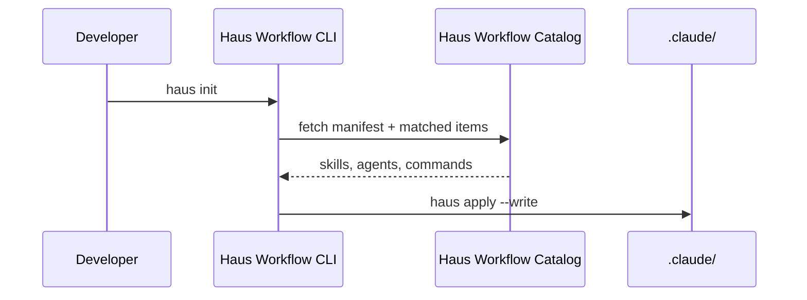

<!-- SITE SHELL: edit this file for @site/ components; synced prose lives in haus-workflow-catalog/docusaurus-docs/ -->

# Haus Workflow Catalog

The **Haus Workflow Catalog** is the source of truth for all skills, agents, slash commands, and templates distributed by [Haus Workflow](../).

**94 catalog items**: 73 skills · 15 agents · 4 templates · 2 configs

| Source label | Count | Origin                                                  |
| ------------ | ----- | ------------------------------------------------------- |
| `haus`       | 27    | First-party: 21 skills + 4 templates + 2 configs        |
| `curated`    | 67    | Verbatim upstream: superpowers + ECC + oh-my-claudecode |

:::note Open-source, internally maintained
The catalog is open-source under MIT. It is maintained exclusively by the Haus Tech team — external issues, PRs, and additions are not accepted.
:::

## Relationship to Haus Workflow

## What gets installed

When `haus recommend` matches items for your project, assets land in `.claude/`:

| Type      | Destination         | Examples                   |
| :-------- | :------------------ | :------------------------- |
| Skills    | `.claude/skills/`   | `haus.typescript-patterns` |
| Agents    | `.claude/agents/`   | ECC code reviewer          |
| Commands  | `.claude/commands/` | `/haus-workflow` menu      |
| Templates | via apply           | CLAUDE.md scaffolds        |

## Documentation

- [First-party skills](./skills-reference)
- [Update flow](./update-flow)

## Source

[github.com/WeAreHausTech/haus-workflow-catalog](https://github.com/WeAreHausTech/haus-workflow-catalog)
