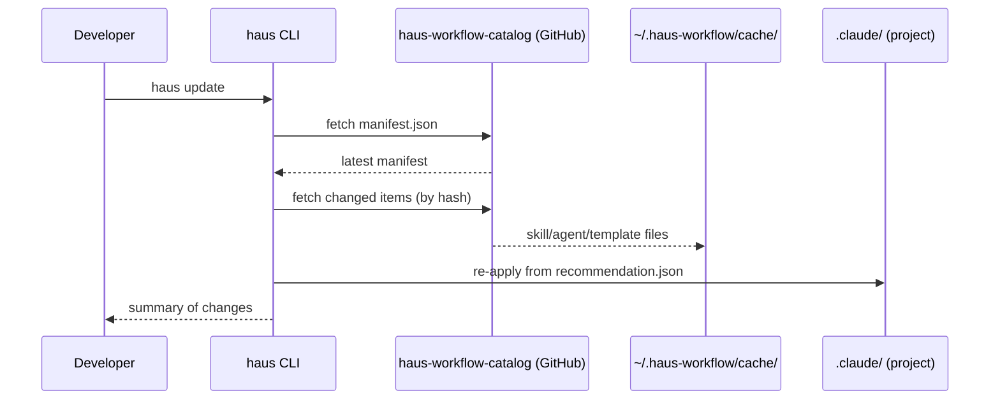

# Update flow

`haus update` keeps your project's `.claude/` in sync with the latest catalog.

## Lock file integrity

Each applied item is recorded in `.haus-workflow/haus.lock.json` with a content hash. On re-apply:

- **Hash matches lock** → item is overwritable; update proceeds
- **Hash differs from lock** → item was user-edited; update skips and warns

This means you can safely edit catalog-installed files locally — haus will not silently overwrite your changes.

## Offline fallback

`haus-workflow` ships a bundled fallback `manifest.json` (at the npm package version). If the catalog fetch fails, haus falls back to the bundled manifest and warns. Items that are missing from the local cache are skipped.
